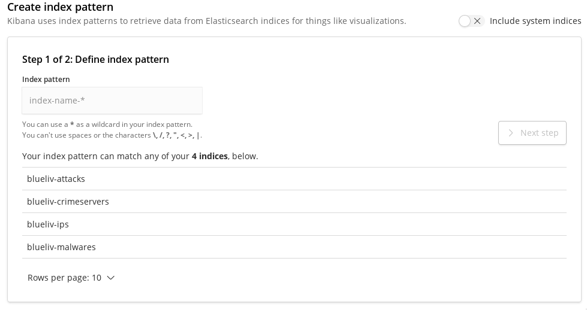
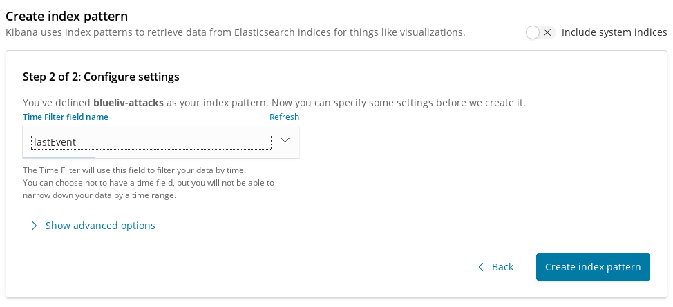
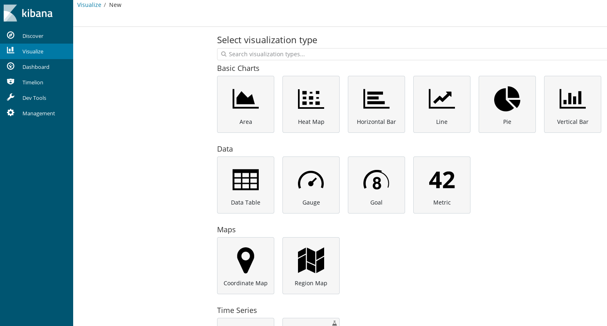
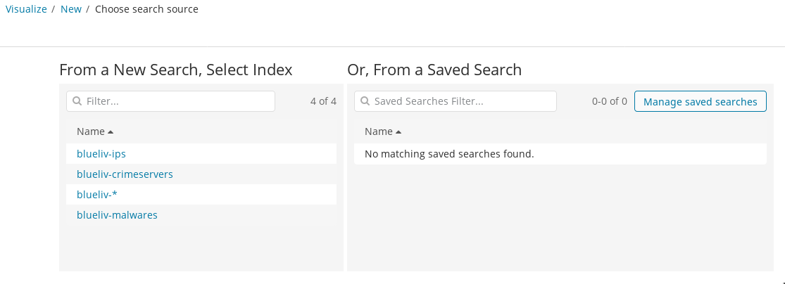
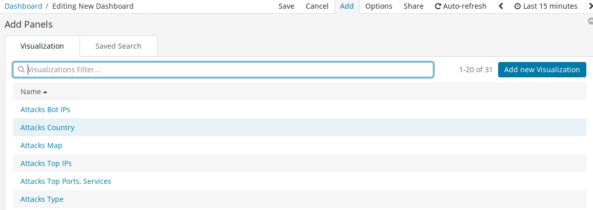
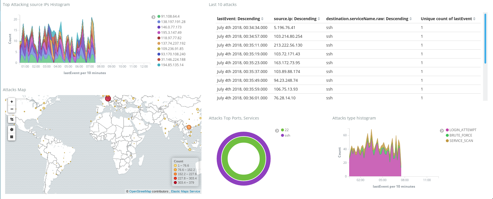
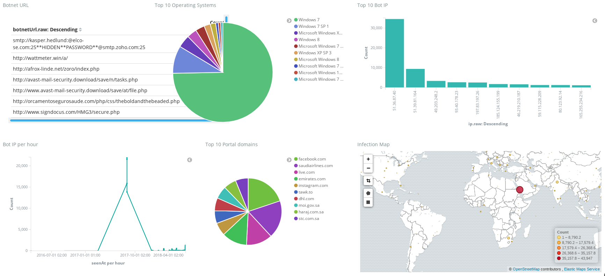
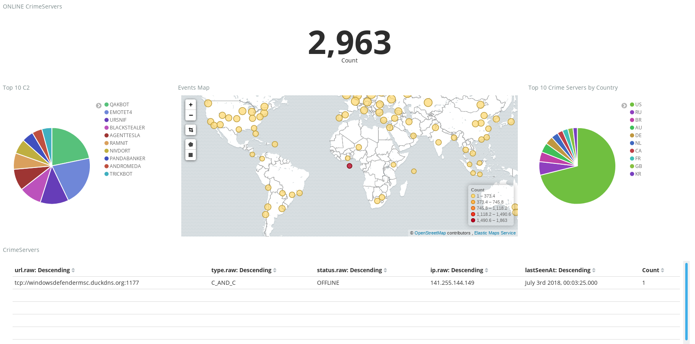
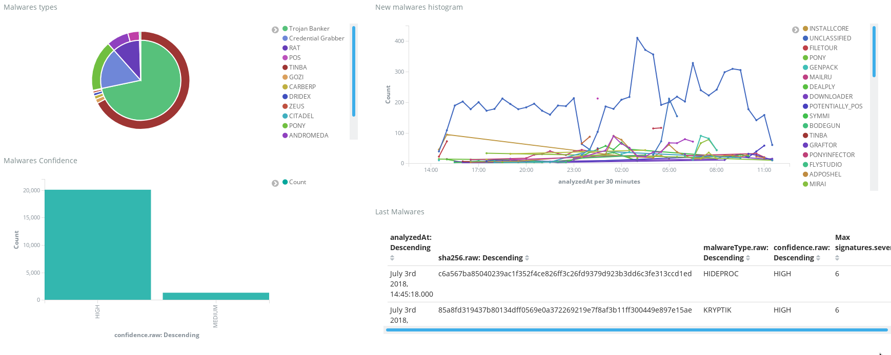

# Introduction

## 1.1 The ELK Stack

The ELK stack contains Elasticsearch, Logstash, and Kibana. Although
theyhave all been built to work exceptionally well together, each one is
 a separate open source project that is driven by Elasticsearch. The
 role of each of these technologies is divided as follows:

**Logstash** Tool for managing events and logs. You can use it to
collect logs, parse them, and store them for later use, such as
searching. You can collect several different types of data from
different sources (logs, HTTP, TCP, Kafka, etc) and then filter or
transform them.

**Elasticsearch** Search server based on Lucene. It provides a
distributed, full-text search engine with a RESTful web interface and
schema-free JSON documents. You can use it to index and aggregate data
from Logstash.

**Kibana** Browser based analytics and search dashboard for
Elasticsearch. You can set-up dashboards with graphics and tables to
visualize your indexed and aggregated data from Elasticsearch.

## 1.2 Logstash Plugins

Since version 1.5, there is a new plugin management system for Logstash.
Plugin repositories are now located at Github. Plugins are now
self-contained Ruby gems hosted in RubyGems. Logstash comes with a
script called plugin, which is used to install the extra plugins. All
plugins can be found listed and searchable at Github. There are three
kinds of Logstash plugin:

**Input** To provide input data into Logstash.

**Filter** To filter data from a given input.

**Output** To save the filtered data anywhere you want, such as
Elasticsearch, for indexing and searching data.

## 1.3 Blueliv on ELK
Blueliv automatically integrates Blueliv’s Cyber Threat Intelligence
into ELK stack, providing an input plugin for Logstash. The use of this
app will add Cyber Threat Intelligence to your existing data, addressing
 a comprehensive range of cyber threats including compromised URLs,
domains, IPs, etc. to turn global threat data into predictive,
actionable intelligence specifically for your enterprise and the unique
threats it faces.

Our powerful networks of specialized search engines constantly scour the
 web for up-to-the- minute data and delivers real-time actionable
 information.

Unsurpassed cyber threat intelligence, now at your disposal.

# Installation

## 2.1 Requirements
This plugin was developed and tested against Logstash 1.5.0, so it
supports this and newer versions. Older versions are not supported due
to changes in Logstash plugin API. As of Elasticsearch and Kibana, you
must use Elasticsearch version ≥ 2.4.0 and Kibana ≥ 4.6.0 in order to
work with Elasticsearch 2.4.x.

## 2.2 Blueliv Plugin
Blueliv provides an input plugin, delivering data about active Crime
Servers and Bot IPs. To install it, please run the following command in
the directory where you installed Logstash:

\# For logstash versions previous to 2.3.0

`bin/plugin install -version 1.0.1 logstash-input-blueliv`

\# In logstash versions >= 2.3.0

`bin/logstash-plugin install logstash-input-blueliv`

## 2.3 Configuration

Before using our plugin, you should configure your API Key (get yours
here) and the feeds that you want to receive. The plugin has the
following configuration parameters:

 * **api_url** the URL of the API. By default its value is
https://api.blueliv.com, but you should change it if you are using our
Free API (https://freeapi.blueliv.com).

 * **api_key** API key to access our feeds. This parameter is
**mandatory** in order to get the plugin working. You can get your Free
API key here or contact us via email in order to get a commercial
account.

 * **http_timeout** HTTP timeout for each API call. Default: 500
seconds.

 * **feeds** this is a Ruby hash that specifies the parameters to access
each one of our feeds. Each feed may be configured with the following
properties:

   * **active** if the feed is active or not. Default: false.

   * **feed_type** the type of the feed that you want. The available
types are the following:

     * **Attacks** This feed has recent and last. Recent is executed
every 3 hours and last is executed every 30 minutes. See
https://apidocs.blueliv.com/#attacking-ips for more information.

     * **Bot IPs** This feed has pos, non_pos, full and test. Pos the
ones that are Point-of-Sale, non_pos to retrieve the ones are not a
Point-of-Sale, full to retrieve all and test returns a small test data
set. See https://apidocs.blueliv.com/#bot-ip for more information.

     * **Crime Servers** This feed has last, recent and test. Last is
executed every 15 minutes, recent every hour and test returns a small
test data set. See https://apidocs.blueliv.com/#crimeservers for more
information.

     * **Malwares** This feed has last and recent. Last is executed
every 10 minutes and recent is executed every hour See
https://apidocs.blueliv.com/#malware for more information.

   * **interval** interval of polling data from our API. It is not
recommended use this configuration because default values are optimized
for our endpoints.

The default configuration for feeds parameter is available at listing
2.1:
```
{
    "attacks" => {
        "active" => false
        "feed_type" => "recent"
        "interval" => 600
    }
    "botips" => {
        "active" => false
        "feed_type" => "test"
        "interval" => 600
    }
    "crimeservers" => {
        "active" => true
        "feed_type" => "test"
        "interval" => 900
    }
    "malwares" => {
        "active" => false
        "feed_type" => "recent"
        "interval" => 3600
    }
}
```
<p align="center">Listing 2.1: Default feeds configuration</p>

### 2.3.1 Example

An example of an input configuration is shown at listing 2.2:

```
input {
    blueliv {
        api_key => "<API KEY>"
        feeds => {
            "attacks" => {
                "active" => true
            }
            "botips" => {
                "active" => true
                "feed_type" => "non_pos"
            }
            "crimeservers" => {
                "active" => true
                "feed_type" => "recent"
            }
            "malwares" => {
                "active" => true
            }
        }
    }
}
```
<p align="center">Listing 2.2: Plugin configuration example</p>

Be aware that if you do not specify a given field, the default value
will be configured. In this case, we did not touch the interval field
for the feeds, so the defaults will apply.

# Getting started

In this chapter we are going to explain how to set-up properly a full
ELK stack in order to take advantage of the cyber-threat intelligence
provided by Blueliv. Please be aware that his is a configuration
suggestion and you may change it to fit your needs. You may skip some of
 the steps if you already have configured your ELK stack.

## 3.1 Logstash Configuration

Our Logstash configuration is divided in two main components, as shown
in listing below.

 * **input** where you must set-up your API key and cyber-threat feeds
that you want

 * **output** where we set-up the way we want to set-up the
output. Our configurations go as following:

   * **index** where we are indexing each feed in a different
Elasticsearch index, i.e., blueliv-attacks, blueliv-crimeservers,
blueliv-ips and blueliv-malwares.

   * **manage_template** where we tell Logstash that we will not manage
Elasticsearch template for our indexes. We explain more on this in 3.2.

   * **document_id** we provide a document_id for Elasticsearch indexes,
 so when a object - such as a Crime Server - is updated, it will update
its entry.

```
input {
    blueliv {
        api_key => "<API KEY>"
        feeds => {
            "attacks" => {
                "active" => false
                "feed_type" => "recent"
            }
            "botips" => {
                "active" => true
                "feed_type" => "non_pos"
            }
            "crimeservers" => {
                "active" => true
                "feed_type" => "recent"
            }
            "malwares" => {
                "active" => false
                "feed_type" => "recent"
            }
        }
    }
}
output {
    elasticsearch {
        index => "blueliv-%{@collection}"
        manage_template => false
        document_id => "%{document_id}"
    }
}
```
<p align="center">Listing 3.1: Full Logstash configuration example</p>

You can find these configurations at our GitHub. If you are are using
our Free API, you should use these configurations.

Please note that the first time you run this plugin in Logstash it may
take some time to download and index all the items.

## 3.2 Elasticsearch Configuration

The only configuration that you need to perform in Elasticsearch is to
upload Blueliv’s index template, shown in listing 3.2. In order to
upload it you nshould make a REST call to the following Elasticsearch
endpoint. You may use curl to do it. If you save our template (3.2) as
template.json, you could just run the following command:

`curl -XPUT localhost:9200/_template/blueliv -d @template.json`

```
{
    "index_patterns": "blueliv-*",
    "settings" : {
        "index.refresh_interval": "5s"
    },
    "mappings": {
        "_default_": {
            "dynamic_templates": [
                {
                    "message_field": {
                      "mapping": {
                        "index": true,
                        "omit_norms": true,
                        "type": "text"
                      },
                      "match_mapping_type": "string",
                      "match": "message"
                    }
                  },
                  {
                    "string_fields": {
                      "mapping": {
                        "index": true,
                        "omit_norms": true,
                        "type": "text",
                        "fields": {
                          "raw": {
                            "ignore_above": 256,
                            "index": true,
                            "type": "keyword"
                          }
                        }
                      },
                      "match_mapping_type": "string",
                      "match": "*"
                    }
                  }
             ],
             "properties" : {
               "location": {
                    "type": "geo_point"
                },
                "lastSeenAt": {
                  "type": "date",
                  "format": "yyyy-MM-dd'T'HH:mm:ssZ"
                },
                "firstSeenAt": {
                  "type": "date",
                  "format": "yyyy-MM-dd'T'HH:mm:ssZ"
                },
                "updatedAt": {
                  "type": "date",
                  "format": "yyyy-MM-dd'T'HH:mm:ssZ"
                },
                "@version": {
                    "index": "false",
                    "type": "keyword"
                },
                "firstEvent": {
                    "type": "date",
                    "format": "yyyy-MM-dd'T'HH:mm:ssZ"
                },
                "lastEvent": {
                    "type": "date",
                    "format": "yyyy-MM-dd'T'HH:mm:ssZ"
                },
                "source":{
                    "type": "object",
                    "properties":{
                        "ip":{
                          "type": "ip"
                        }
                    }
                },
                "analyzedAt": {
                    "type": "date",
                    "format": "yyyy-MM-dd'T'HH:mm:ssZ"
                }
            }
        }
    }
}
```
<p align="center">Listing 3.1: Full ElasticSearch template content</p>

You can find these configurations at our GitHub.

## 3.3 Kibana configuration

In this section we will show you how to set-up your Elasticsearch
indexes (3.4), create charts and data tables (3.5) and put it all
together in a dashboard (3.6). In section 3.6.1 you can find the example
 dashboards that we have set-up.

### 3.3.1 Indexes

To access your Kibana installation you should browse to the
corresponding address (by default: http://localhost:5601). Then you must
 set-up the indexes that you want to get data of. As shown in figure
3.3.1.1 and 3.3.1.2

<div style="text-align:center">
<p align="center">Figure 3.3.1.1: Configuring an index in Kibana. Step one.</p>
</div>

<div style="text-align:center">
<p align="center">Figure 3.3.1.2: Configuring an index in Kibana. Step two.</p>
</div>

As you may noticed, you can configure an index (e.g., blueliv-ips) or a
pattern that has all the indexes you want (e.g., blueliv-*). You must
select a Time-field, which will be the default field used to filter
time-based events. We recommend use the followings for every case:

**blueliv-attacks** use field lastEvent
**blueliv-crimeservers** use field createdAt or lastSeenAt
**blueliv-ips** (Bot IPs feed) use field createdAt
**blueliv-malwares** use field analyzedAt

In any case, you can see more information about the fields on the API
documentation in https://apidocs.blueliv.com

### 3.3.2 Charts

After configuring the indexes, you can now play with the indexed data,
either through search or creating charts and data tables. If you click
in Visualize, on top menu (3.3.2.1), you can choose one of the available
charts or data table.

<div style="text-align:center">
<p align="center">Figure 3.3.2.1: Choosing a chart in Kibana</p>
</div>


After that, you must choose the source for your chart or data table,
either a new search or a saved one (3.3.2.2) on an Elasticsearch index.


<div style="text-align:center">
<p align="center">Figure 3.3.2.2: Configuring an index in Kibana</p>
</div>

After that you may choose the field that you want to show, as well as
the aggregation (geo-location, count, average, etc). You may find some
examples in section 3.3.3.1.

### 3.3.3 Dashboards

Kibana dashboards are just a view where you can get some of your graphs
in a glance as well as rearrange them freely. If you click in Dashboard,
 on top menu (3.2), you can create a new dashboard or load an existing
one. If you want to add a new graph into a dashboard, just click on Add
Visualization button (last left-to-right in figure 3.4). After that you
should choose one of the graphs you created before (see 3.3.2 Charts).

<div style="text-align:center">
<p align="center">Figure 3.3.3: Select a saved graph to add into a Kibana
dashboard.</p>
</div>

You can find these dashboards at our GitHub.

### 3.3.3.1 Example Dashboards

Here you can find four example Dashboards (3.6): Attacks, BotIPs, Crime-
Servers and Malwares. Please be aware that these dashboards will only
work if you set-up the indexes like we explained in listing 3.4.
Otherwise you need to create them yourself.

<div style="text-align:center">
<p align="center">Figure 3.3.3.1.1: Attacks Example Dashboard.</p>
</div>


<div style="text-align:center">
<p align="center">Figure 3.3.3.1.2: Bot IPs Example Dashboard.</p>
</div>


<div style="text-align:center">
<p align="center">Figure 3.3.3.1.3: Crime Servers Example Dashboard.</p>
</div>


<div style="text-align:center">
<p align="center">Figure 3.3.3.1.4: Malware Example Dashboard.</p>
</div>


## 4 Registration
If you are interested in getting full access to our Threat Intelligence
feed, contact us via email to get your API credentials that will allow
you to update your local Data Base with current and real-time Threat
Intelligence updates.

There are two access modes, Commercial and Free. If you are using the
Free access, you will not have access to all the data we offer.

